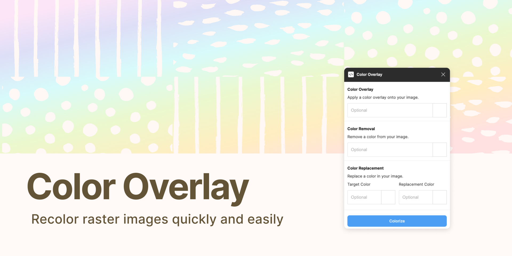

## [Try it out](https://www.figma.com/community/plugin/786223450940846289)

Note: This plugin is now a freemium resource and closed source on Figma. No further code updates will be made on this repository, however you may still download the existing files to learn and use for your personal development.

---
## Recolor images right in Figma, saving minutes of precious time.

Now usable with jpegs and pngs with solid backgrounds.
Works best with images containing solid fills and colors.

---
To use:
- import your image
- run the plugin
- enter the hex color you want to overlay your image
- optionally choose to remove a solid color from the image
- click 'Colorize'

---
If you run into any bugs or have feature requests please submit an issue.